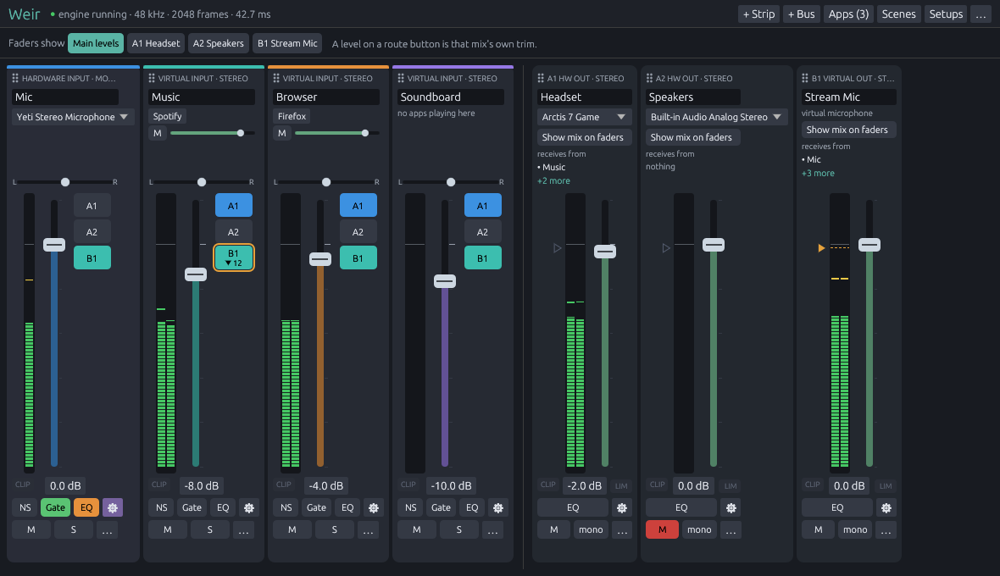
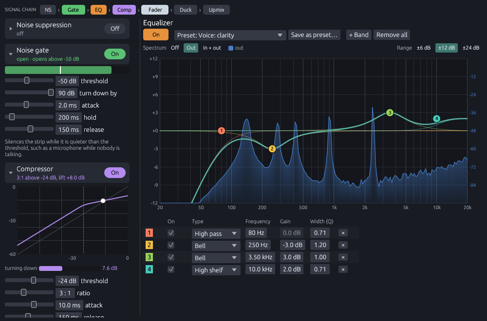
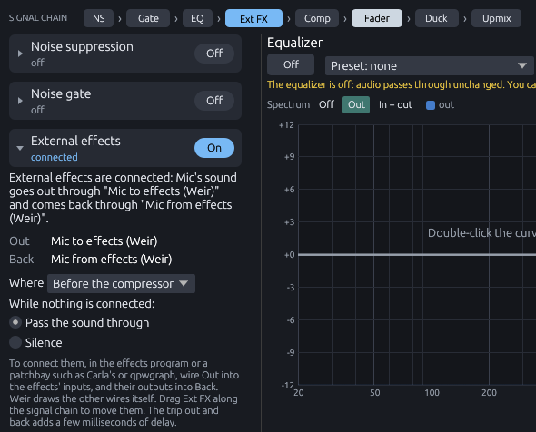
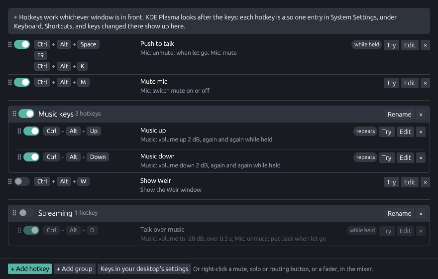
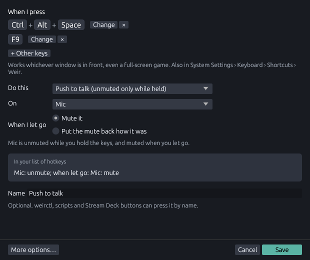

# Weir user guide

This guide explains everything in Weir's window. If you are new, read
[The idea](#the-idea) and [First steps](#first-steps); the rest you can
look up when you need it.



## Contents

* [The idea](#the-idea)
* [First steps](#first-steps)
* [Getting sound into Weir](#getting-sound-into-weir)
* [A tour of the window](#a-tour-of-the-window)
* [Who hears what](#who-hears-what)
* [Effects](#effects)
* [Surround sound](#surround-sound)
* [Scenes and setups](#scenes-and-setups)
* [Hotkeys](#hotkeys)
* [Names, colors and order](#names-colors-and-order)
* [Undo](#undo)
* [Preferences](#preferences)
* [Weir in the background](#weir-in-the-background)
* [Mouse and keyboard](#mouse-and-keyboard)
* [Where Weir keeps things](#where-weir-keeps-things)
* [When something is wrong](#when-something-is-wrong)

## The idea

Weir sits between your applications and microphones on one side and your
speakers, headphones and virtual microphones on the other, and lets you
decide how loud each thing is, and where it goes.

```
 Spotify ──▶ Music strip ───┐                       ┌──▶ Headset bus ──▶ your headphones
 Firefox ──▶ Browser strip ─┼──▶ routing buttons ───┤
 your mic ─▶ Mic strip ─────┘                       └──▶ Stream Mic bus ─▶ Discord, OBS
```

* A **strip** is something coming in. A *virtual* strip is a playback
  device of its own, such as "Music (Weir)", that applications can choose
  in their sound settings. A *hardware* strip captures from a real device,
  such as your microphone.
* A **bus** is somewhere sound goes. A *hardware* bus plays to a real
  device, such as your headset. A *virtual* bus is a microphone of its own,
  such as "Stream Mic (Weir)", that Discord, OBS or a browser can record
  from.
* The **routing buttons** on each strip, labeled `A1`, `B1` and so on,
  send it to buses. Every bus hears its own mix of the strips sent to it.

So you can hear your music and your game without your own voice, while
your stream hears your voice with the music underneath, quieter. That is
the kind of thing Weir is for.

## First steps

The first time Weir starts, it sets up four strips and three buses:

| Strips | | Buses | |
|---|---|---|---|
| **Mic** | your microphone | **Headset** (A1) | what you hear |
| **Music** | an app device | **Speakers** (A2) | a second output, spare |
| **Browser** | an app device | **Stream Mic** (B1) | a microphone for other programs |
| **Soundboard** | an app device | | |

Music, Browser and Soundboard go to both Headset and Stream Mic. Mic goes
only to Stream Mic, so you do not hear yourself.

To get going:

1. On the **Mic** strip, pick your microphone from the device list under
   its name.
2. On the **Headset** bus, pick your headphones or speakers.
3. Put your applications on strips: pick "Music (Weir)" or "Browser (Weir)"
   as the output device in each application's sound settings, or use the
   **Apps** menu at the top right (see below).
4. In Discord, OBS, or wherever others should hear you, choose **Stream Mic
   (Weir)** as the microphone.

That is all. Change who hears what with the `A1` and `B1` buttons beside
each fader.

## Getting sound into Weir

**Applications** play into Weir by choosing one of its strips as their
output device. There are three ways:

* In the application's own settings, or the system's volume control, pick
  the strip's device, such as "Music (Weir)".
* In Weir's **Apps** menu at the top right, which lists everything playing
  sound, pick an application and a strip under **Move to**. On a virtual
  strip, clicking an application's name does the same.
* Let a **rule** do it every time. In the **Apps** menu, pick an application
  and **Always play … into** a strip; or open **Rules…** from the same menu
  to see and change them all, or add one for an application that is not
  playing right now. A rule moves an application as soon as it starts
  playing. Move it by hand afterwards and it stays where you put it. A rule
  set to **leave alone** keeps Weir's hands off it.

Each virtual strip lists the applications playing into it. Under each name
is a slider for that application's own volume, with its own mute: the same
volume the system's volume control shows for it, so the two always agree.
(Preferences can hide the sliders.)

**Microphones and other inputs** come in through hardware strips: pick the
device from the list under the strip's name. A device that is unplugged
keeps its place, grayed out with "not plugged in" under it, and is used
again as soon as it comes back.

**The system's volume on Weir's devices.** Weir's own devices also appear
in the system's volume control, with a volume of their own. Weir never
changes those, because they belong to the system, but when one is not at
100% the strip or bus says so in yellow, for example "system volume 70%":
everything through that device is turned down before (for a strip) or
after (for a bus) Weir's own fader. Put it back to 100% in the system's
volume control.

## A tour of the window

### The top

The bar along the top shows whether the engine is running, and at what
sample rate and buffer size. "held" beside one means Weir is holding
PipeWire at it (see [Preferences](#preferences)). An error from the last
thing you did appears here for a few seconds.

On the right:

* **+ Strip** and **+ Bus** add one.
* **Apps** lists the applications playing, and holds the rules.
* **Scenes** and **Setups** save and bring back how things are.
* **Hotkeys** lists the keys that do things in the mixer from anywhere
  (see [Hotkeys](#hotkeys)).
* **…** has undo and redo, **Recent changes**, **Preferences**, **About**
  and **Quit window**.

Under it, **Faders show** chooses what the strip faders set: their own
level, or their level in one bus's mix (see [Who hears what](#who-hears-what)).

### A strip

From top to bottom:

* **The caption**, such as "VIRTUAL INPUT · STEREO", with six dots in front.
  Drag it to move the strip.
* **The name.** Click it to rename the strip. With
  [external effects](#external-effects) on, a badge beside it says whether
  they are working: **EXT** while they are connected, a yellow **EXT !**
  while they are not. Click it for their settings.
* **The source**: a device list on a hardware strip, or the applications
  playing into a virtual one.
* **Pan**, from left to right. Double-click it to center it.
* **The meter and the fader.** The meter shows the level after the strip's
  effects and fader, one bar per channel, with a mark that holds each peak
  for a moment. Drag the fader, scroll over it for 1 dB steps, or
  double-click it for 0 dB; hold Shift while dragging for fine control.
* **Routing buttons**, one per bus, beside the fader: lit when the strip is
  sent to that bus. See [Who hears what](#who-hears-what).
* **CLIP** and the level. The level can be typed into. CLIP lights up, and
  stays lit until clicked, when the strip reaches full scale: something is
  too loud and will distort.
* **Effect switches**: **NS**, **Gate** and **EQ**, and **⚙**, which opens
  the strip's settings window. See [Effects](#effects).
* **M** (mute), **S** (solo) and **…**, a menu with the settings window,
  the channel layout, moving and coloring the strip, resetting the fader
  and pan, and removing it.

### A bus

* **The caption**, with the bus's label, such as "A1 HW OUT · STEREO", and
  **the name**, as on a strip.
* **The device** it plays to, or, on a virtual bus, a note that other
  programs can record from it.
* **Show mix on faders**, which turns the strip faders into this bus's mix.
* **Receives from**: the strips sent to it. Strips that are muted, or
  silenced by solo, are dimmed. Hover over the list for all of them.
* **The ceiling handle**, a small triangle left of the meter, which sets the
  safety limiter (see [Safety limiter](#safety-limiter-and-clip-lights)).
* **The meter and the fader**, as on a strip.
* **CLIP**, the level, and **LIM**, which lights while the limiter is
  holding the bus down.
* **EQ** and **⚙**, and **M** (mute), **mono** and **…**.

## Who hears what

Each routing button beside a strip's fader sends that strip to one bus.
Click it to switch it on or off.

Every bus gets its own mix, so a strip can also be louder in one than in
another: music quiet in your headphones and louder on your stream, say.
A strip's level in a bus's mix is on top of its fader.

* **Right-click** a routing button to type in the level for that mix.
* Or choose that bus under **Faders show**, at the top. The strip faders
  then set each strip's level in that mix alone, in the bus's color, and
  strips not sent to it are grayed out. **Main levels** goes back.

A routing button shows the level when it is not 0 dB, such as `B1 −5 dB`,
so you can see at a glance which mixes differ. Switching a route off and on
again keeps its level.

**Solo** (**S**) plays only the soloed strips. By default every other strip
goes silent everywhere. Preferences can instead make solo only change one
bus's mix, such as your headphones, so you can listen to a strip on its own
without your stream noticing.

## Effects

Every strip has noise suppression, a noise gate, an equalizer, a compressor
and ducking. Every bus has an equalizer and a safety limiter. Both can also
send their sound to another program for effects Weir does not have, and
take it back: see [External effects](#external-effects). They are all off
until you switch them on.

Under each strip's fader are switches for the three used most: **NS**
(noise suppression), **Gate** and **EQ**. The **Gate** button dims while
the gate is closed, so you can see it working. **⚙** opens the strip's
settings window, which holds everything; it turns purple while the
compressor is on, and brightens while it is working. Right-clicking any of
the switches opens the window too.

### The settings window

Each strip and bus has a settings window of its own, which can sit on
another screen while you work. Along the top is the **signal chain**: every
step the sound goes through, in order, lit where it is on.

* A strip: noise suppression, gate, equalizer, compressor, fader, ducking,
  upmix.
* A bus: downmix, equalizer, fader, safety limiter, delay.

**Ext FX**, external effects, sits in the chain wherever you put them.

Click a step to go to its settings. The equalizer fills the middle of the
window, and everything else has a section down the left that folds away.
A section's header says what it is set to, and has an **On**/**Off** switch
where the effect can be switched off.



### Noise suppression

Takes steady background noise out of a voice: fans, hum, hiss, a noisy
room. It uses RNNoise, a small neural network trained on speech, so it
keeps voices and removes most of everything else. That also means it
mangles music, so keep it on microphones.

**Amount** below 100% mixes some of the original back in, which can sound
more natural. It delays the strip by 20 ms, and only works when PipeWire
runs at 48 kHz, which is the usual rate; the window tells you if it is not
(see [Preferences](#preferences) to hold PipeWire there).

### The noise gate

Silences a strip while it is quieter than a threshold, such as your
microphone while you are not talking, so the room between your sentences
goes quiet. To set it up:

1. Switch the gate on and open the settings window.
2. Stay quiet and watch the level bar: that is your room's noise.
3. Talk normally: the bar jumps up.
4. Drag **threshold** so the white line sits between the two, a little
   above the noise.

**Turn down by** says how far the gate turns the strip down while closed:
90 dB is silence, while something like 15 dB only takes the edge off.
**Hold** keeps it open through the short gaps between words; raise it if
the ends of your sentences get cut off. **Attack** and **release** are how
quickly it opens and closes.

### The equalizer

Shapes the tone: less boom, more clarity, no hum. The settings window draws
it as a curve, from deep bass on the left to treble on the right, with a
numbered handle for each band.

* **Drag** a handle to move a band: left and right for its frequency, up and
  down to boost or cut.
* **Scroll** over a handle to make the band wider or narrower.
* **Double-click** the curve to add a band, or a handle to flatten it.
* **Right-click** a handle to change its type, switch it off or remove it.
  **Delete** removes the selected band.
* The table under the curve has every band's exact values, and can be
  typed into.

The band types are bell (boost or cut around a frequency), low and high
shelf (everything below or above), low and high pass (cut everything below
or above), notch (take out one narrow frequency, such as mains hum) and
band pass. Up to 16 bands.

**Preset** has starting points: for voices (clarity, broadcast, removing
rumble, taming harsh "s" sounds), for mains hum at 50 Hz (Europe) or 60 Hz
(North America), and for listening (bass, treble, loudness, footsteps in
games). **Save as preset…** keeps your own, which then appear on every strip
and bus. Switching the equalizer off keeps the bands, so you can compare.

Behind the curve runs the sound itself, live: gray is what goes into the
equalizer and blue what comes out, so you can see what each band does as
well as hear it. The **Spectrum** buttons choose both, only the output, or
none. The scale on the right belongs to the spectrum, the one on the left
to the curve. Like most analyzers it leans up by 4.5 dB per octave: music
and speech carry less energy the higher they go, and without the lean
everything would slope down to the right.

### The compressor

Evens out a voice: it turns the strip down while it is louder than a
**threshold**, then lifts the whole strip back up, so quiet words are
easier to hear and shouting does not blast anyone's ears.

* **Threshold**: where it starts working. The white dot on the graph is the
  level going in right now; put the threshold a little below your normal
  speaking level.
* **Ratio**: how hard it works above the threshold. At 4 : 1, every 4 dB
  over comes out as 1 dB over. 2 to 4 sounds natural; 8 and up is heavy.
* **Attack** and **release**: how quickly it turns down and lets go. A
  slower attack lets the start of each word through, which keeps speech
  crisp.
* **Lift**: how far it turns the strip back up afterwards. **Set the lift
  automatically** works it out from the threshold and ratio.

The graph shows the level going in along the bottom and coming out up the
side; the dim diagonal is what you would get with the compressor off. The
**turning down** bar shows how hard it is working.

### Ducking

Turns one strip down while another is heard. The classic use is music that
dips while you talk, so your stream can still hear you. Open the settings
window of the strip that should get quieter (the music), and switch on
**Ducking**:

* **While this is heard**: the strips that turn it down, usually your
  microphone. A strip counts as heard while it is louder than **heard
  above** (under **Timing**), and, if its gate is on, while the gate is
  open.
* **Turn down by**: how far.
* **Only in these mixes**: where it happens. Duck the music in `B1` only,
  and your stream hears it dip while you still hear it at full level.
* **Timing**: how quickly it goes down, how long it waits after you stop
  before coming back up (so it does not bob between words), and how slowly
  it comes back.

While a strip is being ducked, its routing buttons for those mixes get an
amber ring and show by how much. The microphone's own settings window lists
the strips it ducks.

### Safety limiter and clip lights

Every bus has a **safety limiter**: a brake that stops the bus from ever
going over a ceiling, turning it down just enough, for just as long as it
needs to. It is what keeps a sudden shout or a loud sound effect from
distorting your stream.

The small triangle left of a bus's meter is the ceiling, with a dashed line
across the meter at the same level.

* **Drag** the triangle to move the ceiling. **Scroll** over it for
  half-decibel steps, and **double-click** it to put it back at -1 dB.
* While the limiter is working, an amber bar hangs from the triangle, as
  long as the amount it is turning the bus down by, and **LIM** lights up.
* **Click** LIM to open the limiter's settings: on or off, the ceiling, and
  **release**, how quickly the bus comes back up afterwards.
* **Right-click** the triangle or LIM for the same, without the window.

Virtual buses start with the limiter on, at -1 dB: whatever records them
would distort anything louder, and nobody listening to your stream can tell
you it happened. Hardware buses start with it off. The limiter looks 1.5 ms
ahead, so it catches a peak before it happens, and delays the bus by those
1.5 ms while it is on.

The **CLIP** light under every fader lights up when that strip or bus goes
over full scale, the loudest a sound card or a recording can carry, and
stays lit until you click it, so you notice even if you looked away.

### Bus delay

A bus can hold its sound back by up to half a second. It is for playing
the same music on two outputs that do not take equally long, such as
speakers next to a Bluetooth speaker, which is usually 100 to 250 ms
behind: put the delay on the faster bus until the two line up.

Open the bus's settings window and unfold **Delay**: drag the slider, click
the number to type an exact value, or use the **-1 ms** and **+1 ms**
buttons to nudge it while you listen. The bus's **…** menu has a quick
Delay field too, which you drag. Changing the delay while music plays
blends from the old one to the new one, so there is no click. The signal
chain at the top of the window shows a **Delay** stage when it is on.
Everything on that bus is delayed, so a video's sound plays that much after
its picture.

### External effects

Weir's own effects are the ones voices need most. For anything else, such
as a reverb, a pitch shifter or a plugin you already have, a strip or bus
can send its sound out to another program and take it back:
[Carla](https://kx.studio/Applications:Carla), which loads LV2, VST and
other plugins, [EasyEffects](https://github.com/wwmm/easyeffects), or
anything else that works with PipeWire. Coming from Voicemeeter, this is
Weir's version of its inserts.

Switch on **External effects** in the strip's or bus's settings window.
Weir then makes two devices for it, named after it:

* **"Mic to effects (Weir)"**, a microphone the effects program records
  from (**Out** in the settings window);
* **"Mic from effects (Weir)"**, an output it plays into (**Back**).

Connect the program to them in its own settings, or with a patchbay such
as Carla's or qpwgraph. What comes back carries on through the rest of the
chain.

**Connecting Carla, step by step.** Say you want a reverb on Music:

1. Switch on **External effects** for Music. Its badge shows a yellow
   **EXT !** until the effects are connected.
2. In Carla, click **Add Plugin** and load your reverb.
3. Open Carla's **Patchbay** tab. Each program and device is a block, with
   its inputs on the left and its outputs on the right.
4. Find **Music to effects (Weir)**. Drag a wire from each of its outputs,
   left and right, to the reverb's inputs.
5. Drag a wire from each of the reverb's outputs to the inputs of
   **Music from effects (Weir)**.

The badge turns into a blue **EXT**, and Music plays through the reverb.
With Weir's own wires, the blocks make a line: Weir's engine, **Weir
Engine**, into "Music to effects", through the reverb, into "Music from
effects", and on into **Weir effects return**, where the sound comes back
into Weir. Weir draws the wires to and from its own blocks itself, and
draws them again if one is removed, so there is nothing else to connect. To keep the wiring
for next time, save a project in Carla (**File › Save**) and open it again
later.

**Where they go.** **Ext FX** sits in the signal chain along the top of
the settings window. Drag it to another gap to move it, or choose under
**Where**. A strip's can go anywhere from before noise suppression to just
after the fader; after the fader, the effects hear the strip as loud as it
is in the mix. A bus's can go anywhere from straight after its mix to after
the limiter.

**While nothing is connected**, the strip or bus either passes its sound
through, as if external effects were off, or stays silent, as you choose.
Silence suits a voice that should never be heard without its effects.

**At a glance**, a badge beside the name says whether they are working: a
blue **EXT** while something plays into "from effects", a yellow
**EXT !** while nothing does. Hover over it for what that means for the
sound, and click it for the settings. **Ext FX** in the signal chain lights
up in the same colors.

**Renaming** a strip or bus with external effects on renames its two
devices too, so Weir asks first. Whatever is connected to them is
connected again, but a program that finds devices by name when it starts,
such as Carla opening a saved project, will need connecting to the new
names.

The trip out and back adds a few milliseconds of delay, on top of whatever
the effects program adds.



## Surround sound

Every strip and bus has its own channel layout: mono, stereo, quad, 5.1 or
7.1, set when adding it or from its **…** menu. Weir connects different
layouts sensibly on its own: a mono microphone plays in both ears, a stereo
strip on 5.1 speakers plays on the front pair. Two settings decide the
rest.

### Downmix: more channels than speakers

In a bus's settings window. It decides how the bus plays channels it has no
speaker for, such as a 5.1 film on stereo headphones:

* **Standard**: the center goes into both front speakers, and each surround
  into the front on its side. This is what TVs and players do (ITU-R
  BS.775). **Center** and **Surrounds** set how loud those are, in the
  steps the broadcast standard uses; -3 dB is standard, and a louder center
  makes dialog clearer.
* **Matrix surround** (also called Lt/Rt): folds the surrounds in so that a
  receiver or soundbar with Pro Logic II, or anything like it, can pull them
  back out. Use it for a bus that feeds such a receiver.
* **Keep the subwoofer channel**: mixes the LFE channel into the front
  speakers. Standard downmixes leave it out.
* **Front only**, **Center only**, **Subwoofer only**, **Surrounds only**:
  play just that part of a strip, on the bus's two speakers. With one bus
  per stereo device, several stereo devices can make up one surround
  system.

### Upmix: more speakers than channels

In a strip's settings window. It decides how a strip plays on a bus with
more speakers than it has channels, such as stereo music on 7.1 speakers:

* **Off**: stereo plays on the front left and right only. The default.
* **Center fill**: the center speaker also plays what left and right have
  in common, which anchors voices to the screen.
* **All-channel stereo**: the left channel on every left speaker, the right
  on every right one, and the center too. Loud and even; good for music
  around a room.
* **Passive surround**: the classic matrix decode. What differs between left
  and right (room sound, crowds, effects) goes to the surround speakers,
  slightly delayed so it stays behind you, and the center gets what the two
  share. Films and TV that carry surround inside stereo come alive.
* **Bass on the subwoofer**: also plays everything below 120 Hz on the
  subwoofer, for strips without a subwoofer channel of their own.

Upmixing only fills speakers nothing else plays.

### Coming from Voicemeeter

Voicemeeter sets these per bus, as bus modes. Here is where each one is in
Weir:

| Voicemeeter bus mode | In Weir |
|---|---|
| Normal | Nothing to set: strips play on the speakers they have. |
| Mix Down B (surrounds in phase) | A stereo bus with the **Standard** downmix. |
| Mix Down A (surrounds out of phase) | A stereo bus with the **Matrix surround** downmix. |
| Stereo Repeat | **All-channel stereo** upmix on the strips. |
| TV Mix | **Passive surround** upmix on the strips, with **Bass on the subwoofer**. |
| UpMix 2.1 / 4.1 / 6.1 | A bus with that layout, **All-channel stereo** upmix and **Bass on the subwoofer**. |
| Center Only / LFE Only / Rear Only | **Center only**, **Subwoofer only** or **Surrounds only** downmix on a stereo bus. |
| Composite | Not needed: every bus already has its own mix of every strip. |

## Scenes and setups

The **Scenes** and **Setups** menus at the top keep what you set up, in two
halves:

* **Scenes** keep the mix: every fader, mute, route, send level and effect.
  Loading one never changes which devices are used, so a "Streaming" or
  "Late night" scene works whichever headset is plugged in.
* **Setups** keep the mixer's shape: which strips and buses there are, and
  their devices, layouts, names and colors. Switch between "Desk" and
  "Laptop" when you move. Strips and buses in both keep the levels and
  effects they have now.

Click a name to load it; the one last loaded or saved is highlighted.
**save** beside a name replaces it with how things are now, and **delete**
removes it; both ask first. **Save … as** saves under a new name, and says
as you type if the name will not do. Loading can be undone.

## Hotkeys

A hotkey is keys that do something in the mixer, whichever window is in
front, even a full-screen game: mute your microphone, push to talk, turn
the music down, load a scene.



**Hotkeys** at the top opens the list. The line at the top says how keys
reach Weir on your desktop (see
[Your desktop and the keys](#your-desktop-and-the-keys)). For each hotkey:

* the **dots** at its left move it: drag it to another place in the list,
  or into a group. A blue line shows where it will go, wherever the
  pointer is in the list.
* the **switch** turns its keys on or off. Off, it can still be pressed by
  name.
* its **keys**, one set to a line, and what it does. **while held**,
  **repeats** and **cycles** say how it behaves.
* **Try** does what pressing and letting go of its keys would.
* **Edit** changes it, and **×** removes it, after asking.

With no hotkeys yet, **Add a few examples** adds push to talk, muting the
microphone, music up and down, dipping the music to talk over it, and
bringing up the window, all switched off: switch on the ones you want, and
change their keys if you like.

### Groups

A group keeps hotkeys together, and switches them on and off together: a
group for streaming, say, switched on only while you stream. **+ Add
group** under the list adds one; type its name and press Enter. Each
group is a box holding its hotkeys, and groups and hotkeys in no group can
go in any order.

* Drag a hotkey into a group's box to put it in the group. The group can
  also be picked under **Group** when editing a hotkey. Dragging a hotkey
  out of the box takes it out of its group.
* A group's **switch** turns all its hotkeys' keys on or off. Its hotkeys
  are faded while it is off, and each keeps its own switch for when the
  group is on again.
* Drag a group by the dots on its header to put it in another place.
  **Rename** changes its name, and **×** removes it, after asking; its
  hotkeys stay, in no group.

### Making a hotkey

Click **+ Add hotkey**, or right-click a mute, solo, mono or routing button,
or a fader, and pick **Add a hotkey…**: the new hotkey starts out doing what
that control does. The same menu lists the hotkeys already on the control,
to change one. Each strip's and bus's **…** menu has them too, under
**Hotkeys**.



* **When I press**: press the keys you want, such as Ctrl or Alt with a
  letter. F keys, media keys and Pause can be used on their own. **Esc**
  stops recording. **+ Other keys** adds more keys that do the same, any
  of which work, such as a button on a gaming mouse. **Change** records a
  set again, and **×** takes it away. With no keys at all, a hotkey can
  still be pressed by name from `weirctl`, a script or a Stream Deck
  button.

  On GNOME and Hyprland, which let Weir suggest only one set of keys, more
  are added in the desktop's settings instead (see
  [below](#your-desktop-and-the-keys)): once saved, the hotkey lists every
  key the desktop has for it, **Suggest other keys** gives it the keys you
  press instead of all of those, and **No keys** takes them away.
* **Do this**: what it does, and to which strip or bus.
  * **Mute or unmute**, **Solo**, an effect, or **Send to a bus**: switch
    it each time, always on, always off, or on only **while held**, back
    as it was when you let go.
  * **Push to talk**: the strip is unmuted only while you hold the keys.
    When you let go, **Mute it**, or **Put the mute back how it was**, in
    which case the keys do nothing while it is already unmuted.
  * **Turn the volume up or down** by an amount at each press, again and
    again while the keys are held. **Set the volume** to a level, and put
    it back when you let go if you like. For a strip, **Fader** picks its
    own fader, or its level in one bus's mix: turn the music down on your
    stream and nowhere else.
  * **Change the equalizer preset**, **Load a scene**, or **Bring up the
    Weir window**.
* **Name**: optional. One is made up from what it does.

Each press is one step in [Undo](#undo): **Ctrl+Z** after a push to talk
takes back the whole of it.

### More options

**More options…** shows every step, since a hotkey can do several things
at once, such as dipping the music and unmuting the microphone. **+ Add a
step** picks one the same way as above, and **Up** and **Down** change
their order.

* **Each press** does every step, or only the next one, going round: one
  key to step through equalizer presets or scenes.
* **When I let go**: nothing, put back what pressing changed, or other
  steps of its own.
* **While held**: do it again every so many milliseconds.
* **As API requests** is the hotkey as Weir keeps it. Anything Weir's
  [control protocol](API.md#hotkeys) can do can be a step, and slow fades
  (`over_ms`) are set here. Weir checks it when you save.

**Fewer options** goes back to the simple form, when the hotkey fits it.

### Your desktop and the keys

On KDE Plasma, GNOME 48 and newer, and Hyprland, your desktop looks after
the keys. Each hotkey is one entry in its shortcut settings, under the
hotkey's name. The first time, the desktop asks you to confirm the keys
you pressed. Examples get their entry when you first switch them on, and
removing a hotkey removes its entry.

On Plasma the entries are in **System Settings › Keyboard › Shortcuts ›
Weir**, and **Keys in System Settings** under the list opens that page
(Plasma 6.5 and newer). Keys can be changed in either place: those you give
a hotkey in Weir go into its entry, and those you change there show up in
Weir. A key another program already uses is left out, and the list says
which program has it. A switched-off hotkey keeps its entry and keys, ready
for when you switch it back on, and lets go of the keys meanwhile, so other
programs can use them. Plasma shows the keys of a new hotkey as its
*default shortcut*, with a box to switch it off, and other keys as *custom
shortcuts*.

On GNOME and Hyprland, Weir can suggest only one set of keys for each
hotkey; give it more, or other ones, in the desktop's settings, and Weir
lists them. A switched-off hotkey keeps its entry and keys there, and the
desktop keeps those keys for it meanwhile.

On an X11 desktop, Weir watches the keys itself, and a key another program
already uses is reported in the list. Anywhere else, hotkeys work only by
name: add a shortcut in your desktop's keyboard settings that runs
`weirctl hotkey run "NAME"`.

## Names, colors and order

* **Rename** a strip or bus by clicking its name. Applications playing into
  a renamed strip stay on it.
* **Color** one from its **…** menu: nine ready-made colors, or any other
  from the picker. The color runs along the top and fills the fader.
* **Move** one by dragging it by the dots and caption at its top; a line
  shows where it will land. **Move left** and **Move right** in the **…**
  menu go one step at a time. Buses are labeled `A1`, `A2`... (hardware)
  and `B1`, `B2`... (virtual) from left to right, so moving one can change
  its label.

## Undo

**Ctrl+Z** takes back the last change, and **Ctrl+Shift+Z** or **Ctrl+Y**
brings it back, in the mixer and in settings windows alike. One fader drag
is one step, however long it was. The **…** menu at the top names what the
next undo and redo are, and **Recent changes** lists the last few, so you
can jump back to before any of them. After removing a strip or bus, a
message at the bottom of the window offers to undo it.

The history covers changes made from anywhere, including `weirctl` and
other programs. It does not reach outside the mixer: moving an application,
or its own volume, is not part of it. It lasts until Weir stops.

## Preferences

**Preferences…** is in the **…** menu at the top right.

* **Appearance**: follow the desktop's light or dark setting, or stay dark
  or light. Optionally use the desktop's accent color in place of Weir's
  teal, and its font. Weir switches along with the desktop, even while it
  is open. (This works through the desktop portal, which KDE Plasma and
  GNOME provide; on a desktop without one, Weir stays dark.)
* **Audio**:
  * **Sample rate**: leave it to PipeWire, or hold PipeWire at a rate while
    Weir runs. 48 kHz is recommended: noise suppression only works there.
  * **Buffer size**: how many frames PipeWire works on at a time. Smaller
    means less delay, which you notice when listening to your own
    microphone, but costs more CPU and may crackle on a busy system.
  * The hold ends as soon as Weir stops.
* **Solo**: silence every strip that is not soloed, in every mix; or
  **Cue** on one bus, so soloing only changes what you hear there.
* **Buses**: how much of the list of strips feeding each bus to show:
  hidden, as many as fit, or the full list, scrolling.
* **Applications**: whether each application under a strip gets a volume
  slider.
* **Starting Weir**: **Start Weir when I log in**, and what Weir does
  when it starts: open the mixer window, start it minimized, or run in the
  tray without a window.
* **Tray icon**: in color, or in one color that matches the panel like the
  desktop's own tray icons.

Audio, solo, startup and the tray icon are kept by the Weir service, so
they apply however Weir starts, including at login. The rest belongs to the
window.

## Weir in the background

Weir is two parts: the **service**, which does the mixing and owns the
virtual devices, and the **window**, which shows it. Closing the window
leaves the service running, so applications keep their devices and the
sound keeps flowing. Opening the window again picks up where it was.

**The tray icon** is the service's. Clicking it shows the mixer, opening it
if needed. Its menu has **Show the mixer**, **When Weir starts**, **Restart
Weir** and **Quit Weir**.

**Starting at login.** Tick **Start Weir when I log in** in Preferences.
From your next login, the service starts on its own, so its devices are
there before any application looks for them. Together with **Tray only,
no window** just below it, Weir is ready at login without a window in the
way. The box is grayed out when Weir runs without its service installed,
such as straight from a build folder.

The same from a terminal is `systemctl --user enable weir`, and
`systemctl --user disable weir` to stop. The box shows the change from the
next time Weir starts.

## Mouse and keyboard

| Where | Do | And |
|---|---|---|
| Fader | drag | moves it; with Shift held, finely |
| | scroll | 1 dB steps |
| | double-click | back to 0 dB |
| Pan | drag / double-click | moves it / centers it |
| Application volume | drag, scroll, double-click | as a fader |
| Level under a fader | drag or click and type | sets the fader exactly |
| Routing button | click | send or stop sending |
| | right-click | the level in that mix, or a hotkey |
| Fader, M, S, mono | right-click | add a hotkey, or change one already on it |
| NS, Gate, EQ | click / right-click | switch / open the settings window |
| CLIP | click | clear it |
| LIM | click / right-click | the limiter's settings / quick menu |
| Ceiling triangle | drag, scroll, double-click | ceiling; 0.5 dB steps; back to -1 dB |
| | right-click | the limiter's quick menu |
| Caption at the top | drag | move the strip or bus |
| Name | click | rename |
| Equalizer handle | drag | frequency and gain |
| | scroll | wider or narrower |
| | double-click | flatten the band |
| | right-click | its type, switch off, remove |
| Equalizer curve | double-click | add a band |
| Selected band | Delete | remove it |
| Signal chain step | click | go to its settings |
| Anywhere | Ctrl+Z | undo |
| | Ctrl+Shift+Z or Ctrl+Y | redo |

## Where Weir keeps things

Your settings, which are kept when Weir is uninstalled:

| Where | What |
|---|---|
| `~/.config/weir/config.toml` | Your strips, buses, devices and levels. Saved as you go. |
| `~/.config/weir/scenes/` | Your scenes, one file each. |
| `~/.config/weir/setups/` | Your setups, one file each. |
| `~/.config/weir/eq-presets.toml` | Your equalizer presets. |
| `~/.config/weir/hotkeys.json` | Your hotkeys. |
| `~/.config/weir/gui.toml` | The window's own preferences, and the names of your devices, for showing them while they are unplugged. |
| `~/.config/weir/backups/` | Copies of `config.toml` from the last ten times Weir started with a changed one. To go back to one, quit Weir and copy it over `config.toml`. |
| `~/.local/state/weir/daemon.log` | What the service said, when the window started it. |

To start over completely, quit Weir and delete `~/.config/weir`.

## When something is wrong

**The window says Weir's service stopped.** It shows what the service said
about why, with **Copy the message** for a bug report and **Try again**.
Everything it printed is in `~/.local/state/weir/daemon.log`. To watch it
start step by step, quit Weir and run `weir-daemon` in a terminal; press
Ctrl+C to stop it. If you enabled the service, its messages are in
`journalctl --user -u weir -n 50`.

**An application plays somewhere else.** PipeWire's session manager puts
new applications on the system's default output. Move it with the **Apps**
menu, which the session manager remembers for next time, or give it a rule.

**An application is quiet.** Check its own volume slider under its strip,
and whether the strip shows a yellow "system volume" note: the system's
volume control may have Weir's device turned down.

**Noise suppression does nothing.** It only works at 48 kHz. The settings
window says when PipeWire runs at another rate; hold it at 48 kHz under
**Audio** in Preferences.

**Crackles or dropouts.** The buffer size may be too small for how busy the
computer is. Choose a larger one under **Audio** in Preferences, or let
PipeWire decide.

**You hear yourself.** Mic is probably sent to your headset bus: switch
off its `A1` routing button.

**Others do not hear you.** Check they use **Stream Mic (Weir)** as their
microphone, that Mic is sent to `B1`, and that neither is muted. The meters
on the Mic strip and the Stream Mic bus show where the sound stops.

**A strip shows a yellow EXT !, or is silent with external effects on.**
Nothing plays into its "from effects" device. Check that the effects
program is running, and that it records from "to effects" and plays into
"from effects". With **Silence** chosen for while nothing is
connected, the strip stays silent until it does.

**Known limitations.**

* Pan is a balance control: it turns the other side down rather than
  moving the sound across.
* A settings window remembers its size but not where it was on screen.
* Renaming a virtual strip, or changing its layout, recreates its device.
  Applications playing into it are put back, after a short gap. The same
  goes for the devices of external effects, and the programs connected to
  them.
